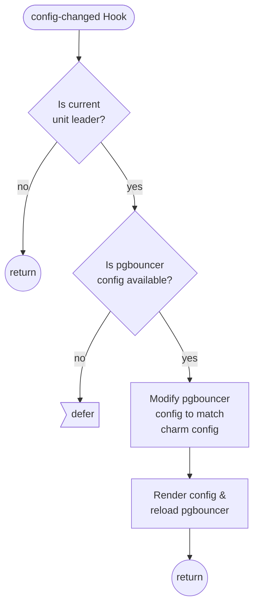
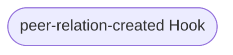

# Contributing

## Overview

This documents explains the processes and practices recommended for contributing enhancements to
this operator.

- Generally, before developing enhancements to this charm, you should consider [opening an issue
  ](https://github.com/canonical/pgbouncer-k8s-operator/issues) explaining your use case.
- If you would like to chat with us about your use-cases or proposed implementation, you can reach
  us at [Canonical Mattermost public channel](https://chat.charmhub.io/charmhub/channels/charm-dev)
  or [Discourse](https://discourse.charmhub.io/).
- Familiarising yourself with the [Charmed Operator Framework](https://juju.is/docs/sdk) library
  will help you a lot when working on new features or bug fixes.
- All enhancements require at least 2 approving reviews before being merged. Code review typically examines
  - code quality
  - test coverage
  - user experience for Juju administrators this charm.
- Please help us out in ensuring easy to review branches by rebasing your pull request branch onto
  the `main` branch. This also avoids merge commits and creates a linear Git commit history.

## Environment Setup

This setup is required for testing and deploying this charm. These instructions are written assuming you're using microk8s as your juju substrate. Instructions for setting this up can be found [here](https://juju.is/docs/olm/microk8s). If you're using a different substrate, update these instructions accordingly.

```shell
# Create a model
juju add-model dev
# Enable DEBUG logging
juju model-config logging-config="<root>=INFO;unit=DEBUG"

# initialise an environment using tox
tox --notest -e unit
source .tox/unit/bin/activate
```

### Testing

```shell
tox -e fmt           # update your code according to linting rules
tox -e lint          # code style
tox -e unit          # unit tests
tox -e integration   # integration tests # TODO does this actually still work?
tox                  # runs 'fmt', 'lint', and 'unit' environments
```

## Build charm

Build the charm in this git repository using:

```shell
charmcraft pack
```

### Deploy

```bash
juju deploy ./pgbouncer-k8s_ubuntu-20.04-amd64.charm \
    --resource pgbouncer-image=dataplatformoci/pgbouncer:1.12-20.04
```

## Canonical Contributor Agreement

Canonical welcomes contributions to the Charmed PGBouncer Operator. Please check out our [contributor agreement](https://ubuntu.com/legal/contributors) if you're interested in contributing.

## Appendices

### Appendix A: Charm Lifecycle Flowcharts

These flowcharts detail the control flow of the hooks in this program. Unless otherwise stated, **a hook deferral is always followed by a return**.

TODO:

- Copy the relevant hook flowcharts into relation documentation, along with the expected relation interface.
- update id syntax because it's clunky

#### Start Hook


#### PgBouncer Pebble Ready Hook


#### Config Changed Hook



#### Peer Relation Created Hook

TODO



#### Peer Relation Changed Hook

TODO


#### Backend Database Created Hook


#### Backend Database Departed Hook

TODO


#### Backend Database Broken Hook

TODO


#### Database Requested Hook

TODO


#### Database Relation Departed Hook

TODO


#### Database Relation Broken Hook

TODO


#### db And db-admin Relation Joined Hook

`db` and `db-admin` relations share the same logic. `db` has been used in this documentation.

TODO


#### db And db-admin Relation Changed Hook

`db` and `db-admin` relations share the same logic. `db` has been used in this documentation.

TODO


#### db And db-admin Relation Departed Hook

`db` and `db-admin` relations share the same logic. `db` has been used in this documentation.

TODO


#### db And db-admin Relation Broken Hook

`db` and `db-admin` relations share the same logic. `db` has been used in this documentation.

TODO


