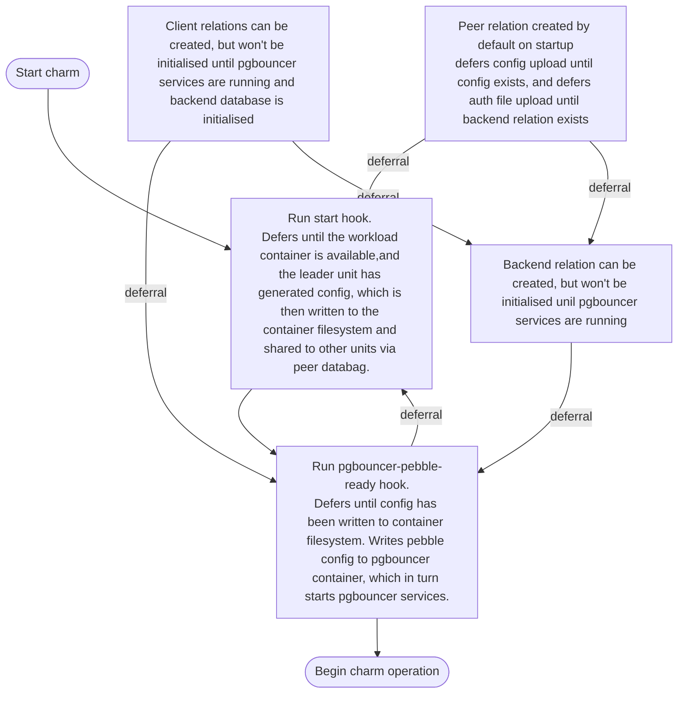
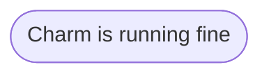

# Charm Reference docs

TODO merge these into the other reference docs once they're merged.

## Event Flowchart

The following charts detail the expected flow of events for the pgbouncer k8s charm. For more information on charm lifecycles, see [A Charm's Life](https://juju.is/docs/sdk/a-charms-life).

### Charm Startup

Relation events can be fired at any time during startup.

TODO format

### Config updates

