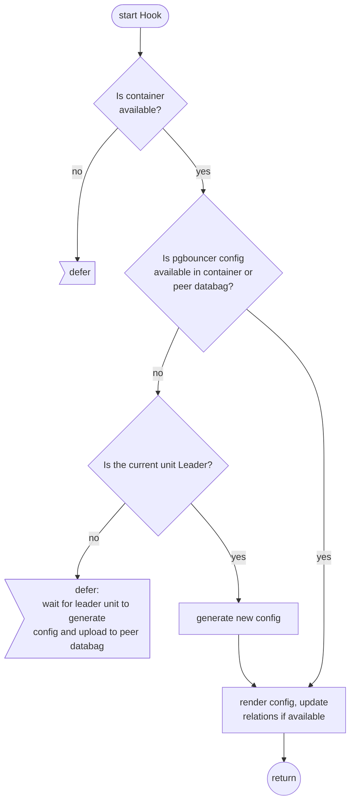
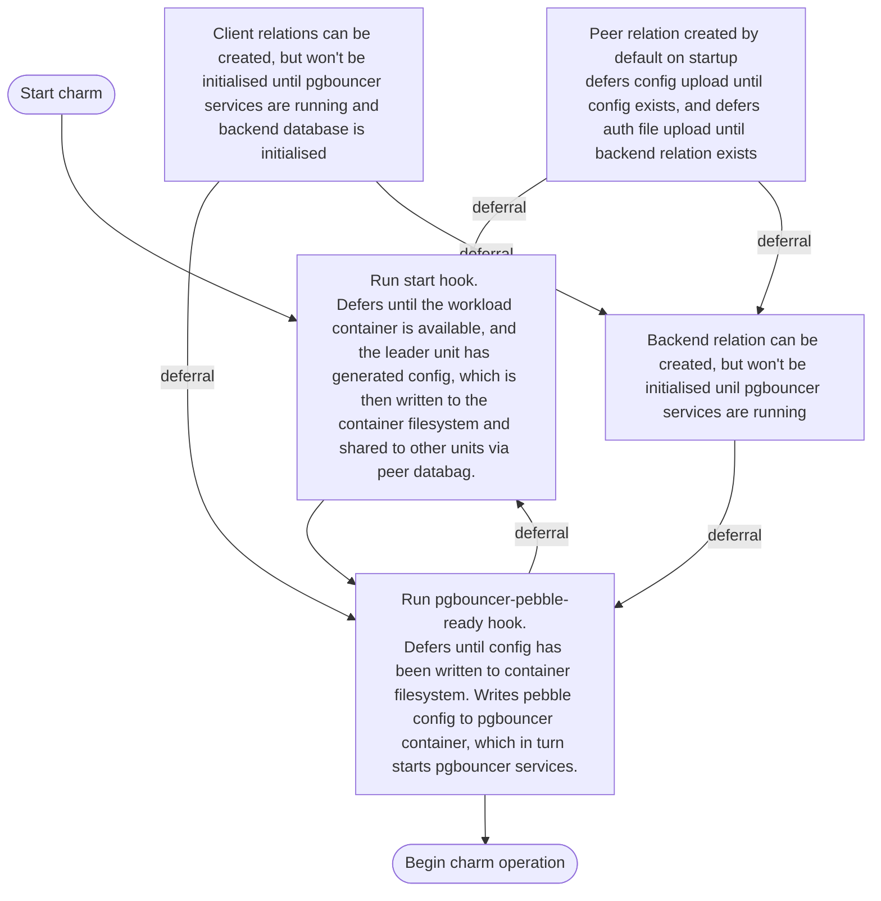
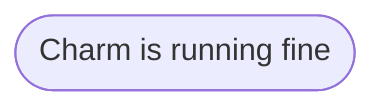

# Charm.py Reference Documentation

This file is the entrypoint for the charm, and contains functions for its basic operation, including its major hooks and file management. This file can be found at [src/charm.py](../../../src/charm.py).

## Hook Handler Flowcharts

These flowcharts detail the control flow of the hooks in this program. Unless otherwise stated, **a hook deferral is always followed by a return**.

### Start Hook

### PgBouncer Pebble Ready Hook

#### Config Changed Hook

## Event Flowchart

The following charts detail the expected flow of events for the pgbouncer k8s charm. For more information on charm lifecycles, see [A Charm's Life](https://juju.is/docs/sdk/a-charms-life).

TODO this is likely to be a spaghetti mess

### Charm Startup

Relation events can be fired at any time during startup.

TODO format

### Config updates

