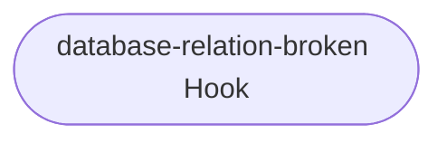
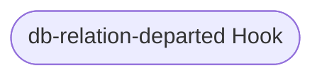
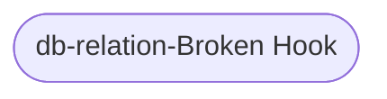

# Hooks

This reference documentation details the flow of each hook handler function.

### Appendix A: Charm Lifecycle Flowcharts

These flowcharts detail the control flow of the hooks in this program. Unless otherwise stated, **a hook deferral is always followed by a return**.

TODO:

- Copy the relevant hook flowcharts into relation documentation, along with the expected relation interface.

#### Start Hook

file: [src/charm.py](https://github.com/canonical/pgbouncer-k8s-operator/blob/main/src/charm.py)

#### PgBouncer Pebble Ready Hook

file: [src/charm.py](https://github.com/canonical/pgbouncer-k8s-operator/blob/main/src/charm.py)

#### Config Changed Hook

file: [src/charm.py](https://github.com/canonical/pgbouncer-k8s-operator/blob/main/src/charm.py)

#### Peer Relation Created Hook

file: [src/relations/peers.py](https://github.com/canonical/pgbouncer-k8s-operator/blob/main/src/relations/peers.py)

#### Peer Relation Changed Hook

file: [src/relations/peers.py](https://github.com/canonical/pgbouncer-k8s-operator/blob/main/src/relations/peers.py)

#### Backend Database Created Hook

file: [src/relations/backend_database.py](https://github.com/canonical/pgbouncer-k8s-operator/blob/main/src/relations/backend_database.py)

#### Backend Database Departed Hook

file: [src/relations/backend_database.py](https://github.com/canonical/pgbouncer-k8s-operator/blob/main/src/relations/backend_database.py)

#### Backend Database Broken Hook

file: [src/relations/backend_database.py](https://github.com/canonical/pgbouncer-k8s-operator/blob/main/src/relations/backend_database.py)

#### Database Requested Hook

file: [src/relations/pgbouncer_provider.py](https://github.com/canonical/pgbouncer-k8s-operator/blob/main/src/relations/pgbouncer_provider.py)

TODO

#### Database Relation Departed Hook

file: [src/relations/pgbouncer_provider.py](https://github.com/canonical/pgbouncer-k8s-operator/blob/main/src/relations/pgbouncer_provider.py)

TODO

#### Database Relation Broken Hook

file: [src/relations/pgbouncer_provider.py](https://github.com/canonical/pgbouncer-k8s-operator/blob/main/src/relations/pgbouncer_provider.py)

TODO

#### db And db-admin Relation Joined Hook

file: [src/relations/db.py](https://github.com/canonical/pgbouncer-k8s-operator/blob/main/src/relations/db.py)

`db` and `db-admin` relations share the same logic. `db` has been used in this documentation, but they're interchangeable.

TODO

#### db And db-admin Relation Changed Hook

file: [src/relations/db.py](https://github.com/canonical/pgbouncer-k8s-operator/blob/main/src/relations/db.py)

`db` and `db-admin` relations share the same logic. `db` has been used in this documentation, but they're interchangeable.

TODO

#### db And db-admin Relation Departed Hook

file: [src/relations/db.py](https://github.com/canonical/pgbouncer-k8s-operator/blob/main/src/relations/db.py)

`db` and `db-admin` relations share the same logic. `db` has been used in this documentation, but they're interchangeable.

TODO

#### db And db-admin Relation Broken Hook

file: [src/relations/db.py](https://github.com/canonical/pgbouncer-k8s-operator/blob/main/src/relations/db.py)

`db` and `db-admin` relations share the same logic. `db` has been used in this documentation, but they're interchangeable.

TODO

