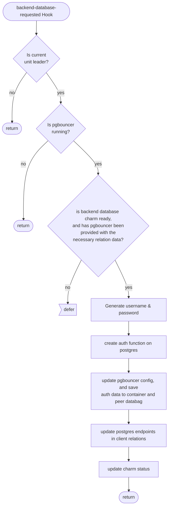
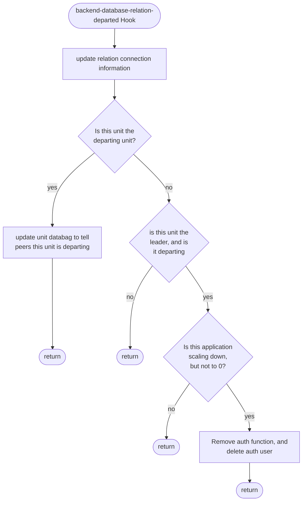
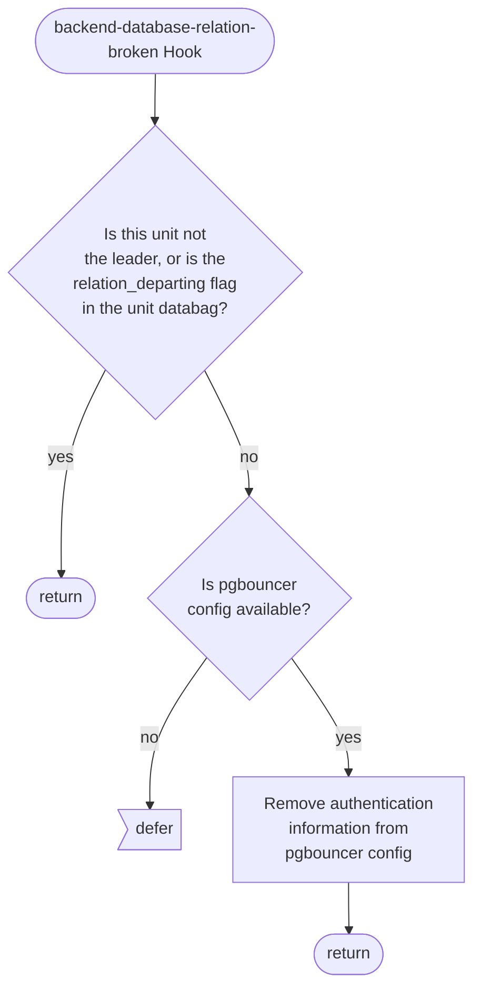

# backend_database Relation Reference Documentation

This reference documentation details the implementation of the `backend-database` relation. The file implementing these relations can be found here: [src/relations/backend_database.py](../../../src/relations/backend_database.py).

## Expected Interface

These are the expected contents of the databags in this relation (all values are examples, generated in a running test instance):
| category         |             keys | pgbouncer-k8s-o… | postgresql-k8s/0 |
|---|---|---|--|
| metadata         |         endpoint | 'backend-databa… | 'database'       |
|                  |           leader | True             | True             |
| application data |             data | {"endpoints":"postgresql-k8s", "password":"18cqKCp19xOPBh",   "read-only-endpoints":"postgresql-k8s","username":"relation_18", "version":"12.9"}    | {"database":"postgresql", "extra-user-roles","SUPERUSER"    |
|                  |         database | pgbouncer        |                  |
|                  |        endpoints |                  | postgresql-k8s-… |
|                  | extra-user-roles | SUPERUSER        |                  |
|                  |         password |                  | 18cqKCp19xOPBh |
|                  | read-only-endpoints |                  | postgresql-k8s-… |
|                  |         username |                  | relation_18      |
|                  |          version |                  | 12.9             |

## Hook Handler Flowcharts

These flowcharts detail the control flow of the hooks in this program. Unless otherwise stated, **a hook deferral is always followed by a return**.

### Backend Database Created Hook

### Backend Database Departed Hook

### Backend Database Broken Hook

