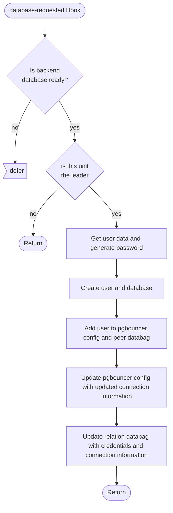
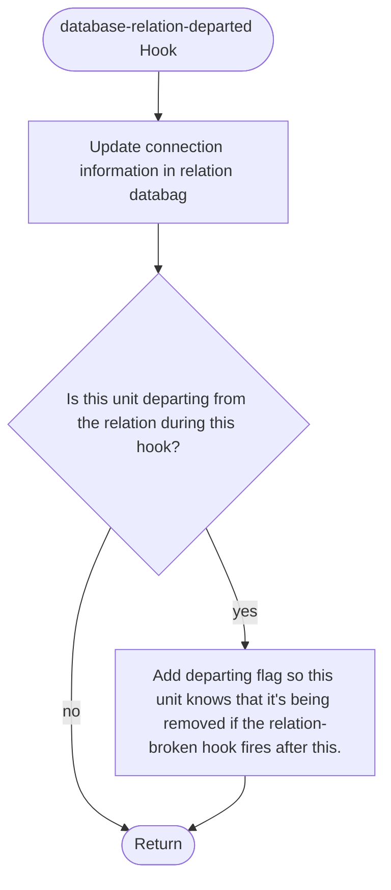
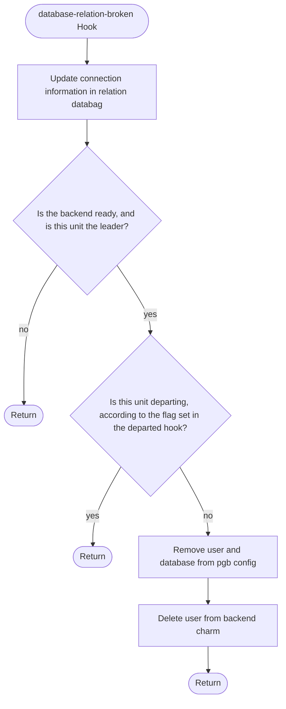

# database Relation Reference Documentation

This reference documentation details the implementation of the `database` relation. This relation is used to connect to applications that use the updated client interface for postgres. The file implementing these relations can be found here: [src/relations/pgbouncer_provider.py](../../../src/relations/pgbouncer_provider.py).

Importantly, this relation doesn't handle scaling the same way others do. All PgBouncer nodes are read/writes, and they expose the read/write nodes of the backend database through the database name f"{dbname}_readonly".

## Expected Interface

These are the expected contents of the databags in this relation (all values are examples, generated in a running test instance):

| relation (id: 4) | application | pgbouncer-k8s|
|---|---|---|
|**metadata**|
| relation name    | first-database | database|
| interface        | postgresql_client | postgresql_client  |
| leader unit      | 0| 1 |
| **application data**| 
| data                |   {"endpoints": "pgbouncer-k8s-1.pgbouncer-k8s-endpoints.test-pgbouncer-provider-5l5…","password": "2LDDKswhH5DdMvjEAZ9igVET", "read-only-endpoints":"pgbouncer-k8s-2.pgbouncer-k8s-endpoints.test-pgbouncer-provider-5l5…", "username": "relation_id_4", "version": "14.5"}  | {"database": "application_first_database", "extra-user-roles":"CREATEDB,CREATEROLE"} |
| endpoints           | | pgbouncer-k8s-1.pgbouncer-k8s-endpoints.test-pgbouncer-provider-5l…  |
| password            | |2LDDKswhH5DdMvjEAZ9igVET |
| read-only-endpoints | | pgbouncer-k8s-2.pgbouncer-k8s-endpoints.test-pgbouncer-provider-5l…  | 
| username            | |  relation_id_4|
| version             | | 14.5 |
| database            | application_first_database | |
| extra-user-roles    | CREATEDB,CREATEROLE| |

## Hook Handler Flowcharts

These flowcharts detail the control flow of the hooks in this program. Unless otherwise stated, **a hook deferral is always followed by a return**.

### Database Requested Hook

TODO format

### Database Relation Departed Hook

TODO format

### Database Relation Broken Hook

TODO format

