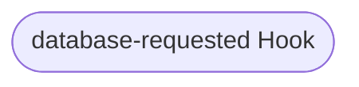
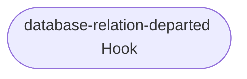
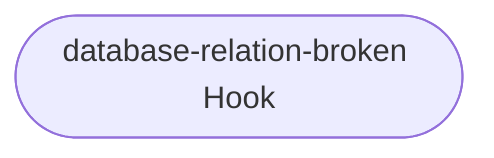

# database Relation Reference Documentation

This reference documentation details the implementation of the `database` relation. This relation is used to connect to applications that use the updated client interface for postgres. The file implementing these relations can be found here: [src/relations/pgbouncer_provider.py](../../../src/relations/pgbouncer_provider.py).

Importantly, this relation doesn't handle scaling the same way others do. All PgBouncer nodes are read/writes, and they expose the read/write nodes of the backend database through the database name f"{dbname}_readonly".

## Expected Interface

These are the expected contents of the databags in this relation (all values are examples, generated in a running test instance):

| relation (id: 4) | application                                                                                   | pgbouncer-k8s                                                                                  |
|---|---|---|---|
│ relation name    │ first-database                                                                                │ database                                                                                       │
│ interface        │ postgresql_client                                                                             │ postgresql_client                                                                              │
│ leader unit      │ 0                                                                                             │ 1                                                                                              │
├
│ application data │ ╭───────────────────────────────────────────────────────────────────────────────────────────╮ │ ╭────────────────────────────────────────────────────────────────────────────────────────────╮ │
│                  │ │                                                                                           │ │ │                                                                                            │ │
│                  │ │  data              {"endpoints":                                                          │ │ │  data                 {"database": "application_first_database", "extra-user-roles":       │ │
│                  │ │                    "pgbouncer-k8s-1.pgbouncer-k8s-endpoints.test-pgbouncer-provider-5l5…  │ │ │                       "CREATEDB,CREATEROLE"}                                               │ │
│                  │ │                    "password": "2LDDKswhH5DdMvjEAZ9igVET", "read-only-endpoints":         │ │ │  endpoints            pgbouncer-k8s-1.pgbouncer-k8s-endpoints.test-pgbouncer-provider-5l…  │ │
│                  │ │                    "pgbouncer-k8s-2.pgbouncer-k8s-endpoints.test-pgbouncer-provider-5l5…  │ │ │  password             2LDDKswhH5DdMvjEAZ9igVET                                             │ │
│                  │ │                    "username": "relation_id_4", "version": "14.5"}                        │ │ │  read-only-endpoints  pgbouncer-k8s-2.pgbouncer-k8s-endpoints.test-pgbouncer-provider-5l…  │ │
│                  │ │  database          application_first_database                                             │ │ │  username             relation_id_4                                                        │ │
│                  │ │  extra-user-roles  CREATEDB,CREATEROLE                                                    │ │ │  version              14.5                                                                 │ │
│                  │ ╰───────────────────────────────────────────────────────────────────────────────────────────╯ │ ╰────────────────────────────────────────────────────────────────────────────────────────────╯ │

## Hook Handler Flowcharts

These flowcharts detail the control flow of the hooks in this program. Unless otherwise stated, **a hook deferral is always followed by a return**.

### Database Requested Hook

TODO

### Database Relation Departed Hook

TODO

### Database Relation Broken Hook

TODO

