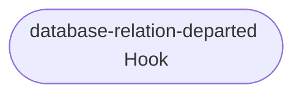
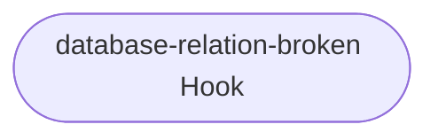

## Hook Handler Flowcharts

These flowcharts detail the control flow of the hooks in this program. Unless otherwise stated, **a hook deferral is always followed by a return**.

### Database Requested Hook

file: [src/relations/pgbouncer_provider.py](https://github.com/canonical/pgbouncer-k8s-operator/blob/main/src/relations/pgbouncer_provider.py)

TODO

### Database Relation Departed Hook

file: [src/relations/pgbouncer_provider.py](https://github.com/canonical/pgbouncer-k8s-operator/blob/main/src/relations/pgbouncer_provider.py)

TODO

### Database Relation Broken Hook

file: [src/relations/pgbouncer_provider.py](https://github.com/canonical/pgbouncer-k8s-operator/blob/main/src/relations/pgbouncer_provider.py)

TODO

