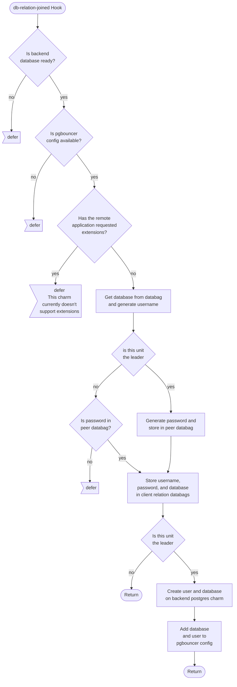
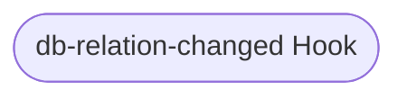
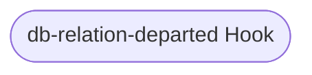
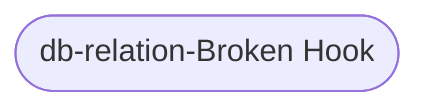

# db and db-admin Relation Reference Documentation

This reference documentation details the implementation of the `db` and `db-admin` relations. These are legacy client relations, and are used to connect to applications that use the legacy interface for postgres; as such, they will be deprecated in future. The file implementing these relations can be found here: [src/relations/db.py](../../../src/relations/db.py).

These two relations are identical, except that the `db-admin` relation has total admin permissions on the postgres charm. This is clearly a security risk, and should only be used where necessary. The updated [client relation](./database.md) provides more finely-grained control over permissions, and is recommended for future charm development.

## Expected Interface

These are the expected contents of the databags in this relation (all values are examples, generated in a running test instance):
| category | keys | pgbouncer-k8s/0 | finos-waltz/0 |
|---|---|---|---|
| metadata         |        endpoint | 'db'                                   | 'db'          |
|                  |          leader | True                                   | True          |
| application data | allowed-subnets | 10.152.183.122/32                      |               |
|                  |   allowed-units | pgbouncer-k8s/0                        |               |
|                  |        database | waltz                                  | waltz         |
|                  |            host | pgbouncer-k8s-0.pgbouncer-k8s-op…      |               |
|                  |          master | host=pgbouncer-k8s-0.pgbouncer-k… dbname=waltz port=6432 user=relation_3  password=BjWDKjvZyClvTl4d5VDOK3mH fallback_application_name=finos-waltz  |               |
|                  |        password | BjWDKjvZyClvTl4d5VDOK3mH               |               |
|                  |            port | 6432                                   |               |
|                  |        standbys | host=pgbouncer-k8s-0.pgbouncer-k… dbname=waltz port=6432 user=relation_3  password=BjWDKjvZyClvTl4d5VDOK3mH fallback_application_name=finos-waltz  |               |
|                  |           state | master                                 |               |
|                  |            user | relation_3                             |               |
|                  |         version | 12.11                                  |               |
| unit data        | allowed-subnets | 10.152.183.122/32                      |               |
|                  |   allowed-units | pgbouncer-k8s/0                        |               |
|                  |        database | waltz                                  | waltz         |
|                  |            host | pgbouncer-k8s-0.pgbouncer-k8s-op…      |               |
|                  |          master | host=pgbouncer-k8s-0.pgbouncer-k… dbname=waltz port=6432 user=relation_3 password=BjWDKjvZyClvTl4d5VDOK3mH fallback_application_name=finos-waltz  |               |
|                  |        password | BjWDKjvZyClvTl4d5VDOK3mH               |               |
|                  |            port | 6432                                   |               |
|                  |        standbys | host=pgbouncer-k8s-0.pgbouncer-k…  dbname=waltz port=6432 user=relation_3  password=BjWDKjvZyClvTl4d5VDOK3mH fallback_application_name=finos-waltz  |               |
|                  |           state | master                                 |               |
|                  |            user | relation_3                             |               |
|                  |         version | 12.11                                  |               |

## Hook Handler Lifecycle Flowcharts

These flowcharts detail the control flow of the hooks in this program. Unless otherwise stated, **a hook deferral is always followed by a return**.

### db And db-admin Relation Joined Hook

### db And db-admin Relation Changed Hook

TODO

### db And db-admin Relation Departed Hook

TODO

### db And db-admin Relation Broken Hook

TODO

