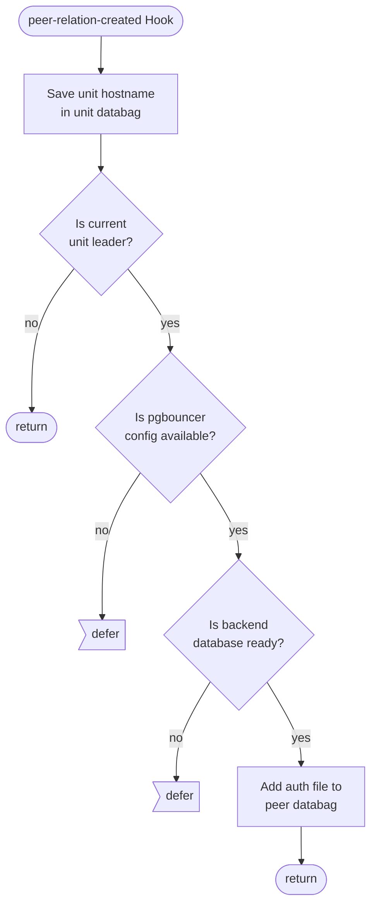
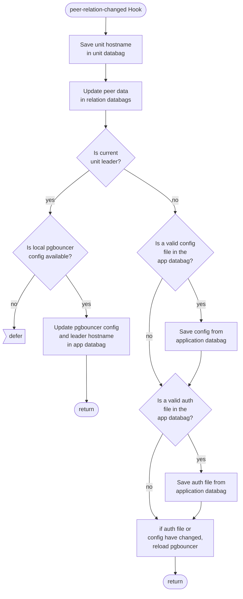

## Hook Handler Lifecycle Flowcharts

These flowcharts detail the control flow of the hooks in this program. Unless otherwise stated, **a hook deferral is always followed by a return**.

### Peer Relation Created Hook

file: [src/relations/peers.py](https://github.com/canonical/pgbouncer-k8s-operator/blob/main/src/relations/peers.py)

### Peer Relation Changed Hook

file: [src/relations/peers.py](https://github.com/canonical/pgbouncer-k8s-operator/blob/main/src/relations/peers.py)

