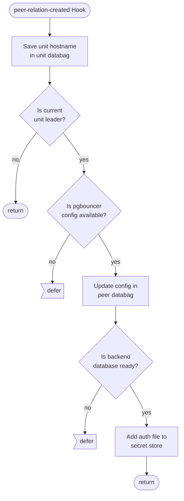
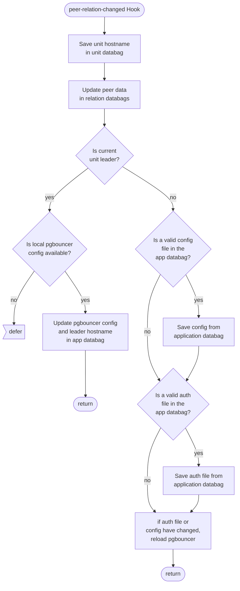

# pgb-peers Relation Reference Documentation

This reference documentation details the implementation of the `pgb-peers` peer relation. This is the peer relation for pgbouncer, used to share user and config information from the leader unit to the follower units. The file implementing these relations can be found here: [src/relations/peers.py](../../../src/relations/peers.py).

## Expected Interface

These are the expected contents of the databags in this relation (all values are examples, generated in a running test instance):

| relation (id: 2) | pgbouncer-k8s |
|---|---|
| **metadata** |  |
| relation name       | pgb_peers|
| interface           | pgb_peers|
| leader unit         | 0|
| type                | peer|
| **application databag** |  |
|  auth_file       | "pgbouncer_auth_relation_id_3" "md5aad46d9afbcc8c8248d254d567b577c1"       |
|  cfg_file        | [example pgbouncer config file](../../../lib/charms/pgbouncer_k8s/v0/pgb.py) |
|  leader_hostname | pgbouncer-k8s-0.pgbouncer-k8s-endpoints.test-pgbouncer-provider-gnrj.svc…  |
|  relation_id_4   | Z4OtFCe6r5HG6mk1XuR6LkwZ                                                   |

## Hook Handler Flowcharts

These flowcharts detail the control flow of the hooks in this program. Unless otherwise stated, **a hook deferral is always followed by a return**.

### Peer Relation Created Hook

### Peer Relation Changed Hook

